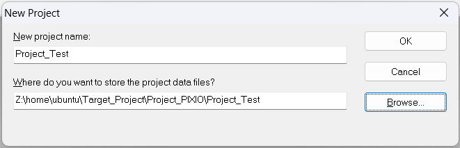
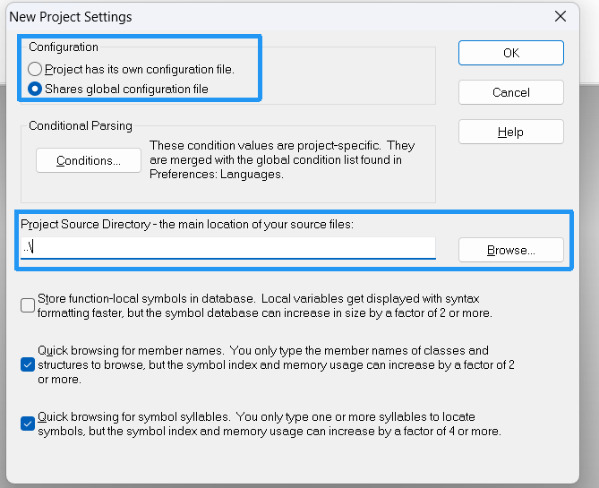
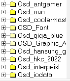
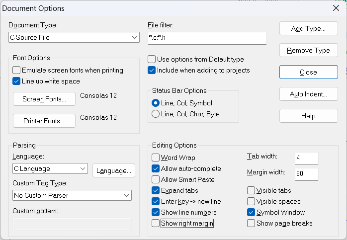

首要问题：一个工程需要什么文件？
-------------------------------------
**注意**：SourceInsight这类编辑器仅用于编辑，涉及到的东西没有直接删除文件什么的，添加的东西能让软件进行跳转，产生文件树而已，所以说完全安全的
同一个项目文件夹可以创建不同的SI项目文件，这些SI项目文件可配置不同的文件树，从而实现打开不同项目文件，访问对应分支的同名文件

# 新建项目
## 1.新建项目文件
新建项目文件的时候产生的效果跟创建分支差不多
Project -> New Project，记得设置项目文件路径时新建同名文件夹然后放进去，方便管理

然后点击OK
## 2.项目文件位置

第一个框的意思是单独配置和共享配置二选一，配置指的是TAB占多少个空格数，字体信息等等的内容
第二个框指的是项目文件存放的位置，如果你新建项目文件是按上面说的，那可以直接../，如果不是，建议直接绝对路径
点击OK后会弹出Add and Remove Project Files，直接Close掉
## 3.添加文件树
找到新建的项目文件(后缀为`.PR`)打开，Project->add and remove project file开始添加文件树
对于有同一系列不同内容的文件夹，这里可单独选一个作为方向分支了

添加好后基本上就OK了

## 基本配置
### DucomentOptions
Option-> Document Options
Tab width: 4
✅ Expand tabs（把 Tab 转成空格，跨编辑器不乱）
✅ Show line numbers（显示行号）
✅ Allow auto-complete(自动补全)

