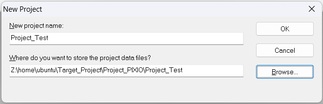
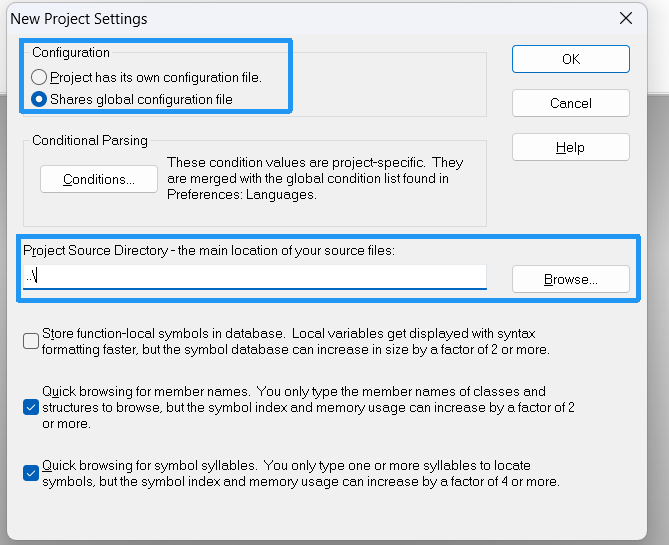
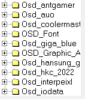
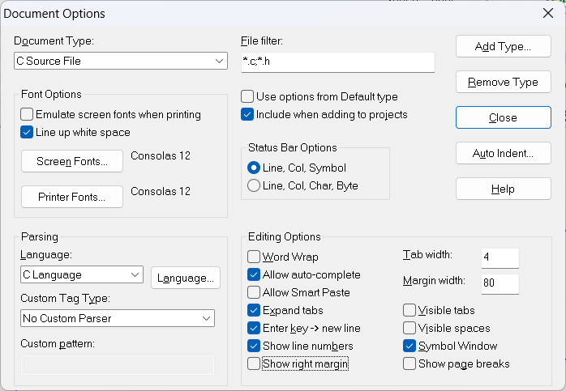

首要问题：一个工程需要什么文件？
-------------------------------------
**注意**：SourceInsight这类编辑器仅用于编辑，涉及到的东西没有直接删除文件什么的，添加的东西能让软件进行跳转，产生文件树而已，所以说完全安全的
同一个项目文件夹可以创建不同的SI项目文件，这些SI项目文件可配置不同的文件树，从而实现打开不同项目文件，访问对应分支的同名文件

# 新建项目
## 1.新建项目文件
新建项目文件的时候产生的效果跟创建分支差不多
Project -> New Project，记得设置项目文件路径时新建同名文件夹然后放进去，方便管理

然后点击OK
## 2.项目文件位置

第一个框的意思是单独配置和共享配置二选一，配置指的是TAB占多少个空格数，字体信息等等的内容
第二个框指的是项目文件存放的位置，如果你新建项目文件是按上面说的，那可以直接../，如果不是，建议直接绝对路径
点击OK后会弹出Add and Remove Project Files，直接Close掉
## 3.添加文件树
找到新建的项目文件(后缀为`.PR`)打开，Project->add and remove project file开始添加文件树
对于有同一系列不同内容的文件夹，这里可单独选一个作为方向分支了

添加好后基本上就OK了

# 基本配置
### DucomentOptions
1.Option-> Document Options
Tab width: 4
✅ Expand tabs（把 Tab 转成空格，跨编辑器不乱）
✅ Show line numbers（显示行号）
✅ Allow auto-complete(自动补全)

字体设置： 位置：当前窗口的Screen Fonts + Printer Fonts
字体都推荐为Consolas 大小为12

2.显示风格设定
位置：Option->Preferences (Colors)
window background是代码窗口的背景色
推荐RGB色系：248, 246, 240
![[assets/SourceInsight3.5/file-20260813135716221.png]]
参考布局
![[assets/SourceInsight3.5/file-20260813140704178.png]]
3.快捷键设置和宏
位置：Option->key assignment 
搜索marco,这里都是一些功能函数也可以添加自定义功能绑定按键 
全选 位置： Navigation:Select All  键位： ctrl + a
多行注释 位置 这个得添加宏函数，下面会提到
![[assets/SourceInsight3.5/file-20260813141407457.png]]
分割字符串功能：
![[assets/SourceInsight3.5/file-20260813142343569.png]]
宏函数设置 位置Project->Open Project -> 点击 Base
功能大致：duohang
打开的文件底部添加：
```
/*注释多行代码的函数*/
macro MultiLineComment()  
{  
    hwnd = GetCurrentWnd()  
    selection = GetWndSel(hwnd)  
    LnFirst = GetWndSelLnFirst(hwnd)      //取首行行号  
    LnLast = GetWndSelLnLast(hwnd)      //取末行行号  
    hbuf = GetCurrentBuf()  
   
    if(GetBufLine(hbuf, 0) == "//magic-number:tph85666031"){  
        stop  
    }  
   
    Ln = Lnfirst  
    buf = GetBufLine(hbuf, Ln)  
    len = strlen(buf)  
   
    while(Ln <= Lnlast) {  
        buf = GetBufLine(hbuf, Ln)  //取Ln对应的行  
        if(buf == ""){                    //跳过空行  
            Ln = Ln + 1  
            continue  
        }  
   
        if(StrMid(buf, 0, 1) == "/") {       //需要取消注释,防止只有单字符的行  
            if(StrMid(buf, 1, 2) == "/"){  
                PutBufLine(hbuf, Ln, StrMid(buf, 2, Strlen(buf)))  
            }  
        }  
   
        if(StrMid(buf,0,1) != "/"){          //需要添加注释  
            PutBufLine(hbuf, Ln, Cat("//", buf))  
        }  
        Ln = Ln + 1  
    }  
   
    SetWndSel(hwnd, selection)  
}  
/*取消注释多行代码的函数*/
macro unMultiLineComment()
{   //取消杠杠注释,不选中多行的话,默认只处理当前行  
    hwnd = GetCurrentWnd()  
    selection = GetWndSel( hwnd )  
    lnFirst = GetWndSelLnFirst( hwnd )  
    lnLast = GetWndSelLnLast( hwnd )  
  
    hbuf = GetCurrentBuf()  
    ln = lnFirst  
    while( ln <= lnLast )  
    {  
        buf = GetBufLine( hbuf, ln )  
        len = strlen( buf )  
        if( len >= 2 )  
        {  
            start = 0  
  
            while( strmid( buf, start, start + 1 ) == CharFromAscii(32) || strmid( buf, start, start + 1 ) 
 
== CharFromAscii(9) )  
            {  
                start = start + 1  
                if( start >= len )  
                    break  
            }  
            if( start < len - 2 )  
            {  
                if( strmid( buf, start, start + 2 ) == "//" )  
                {  
                    buf2 = cat( strmid( buf, 0, start ), strmid( buf, start + 2, len ) )  
                    PutBufLine( hbuf, ln, buf2 )  
                }  
            }  
        }  
        ln = ln + 1  
    }  
    SetWndSel( hwnd, selection )  
}  

/*在多个行后边添加反斜杠'\'*/
macro MacroHuanhangComment()  
{  
    hwnd = GetCurrentWnd()  
    selection = GetWndSel(hwnd)  
    LnFirst = GetWndSelLnFirst(hwnd)      //取首行行号  
    LnLast = GetWndSelLnLast(hwnd)      //取末行行号  
    hbuf = GetCurrentBuf()  
      
    Ln = Lnfirst  
   
    while(Ln <= Lnlast) {  
        buf = GetBufLine(hbuf, Ln)  //取Ln对应的行  

		if(Ln == Lnlast){
			len = strlen(buf)

			if(len > 0){
				start = len - 1
				while( strmid( buf, start, start + 1 ) == CharFromAscii(32))  
	            {  
	            	if(start == 0)
	            		break
	                start = start - 1  
	            }

	            if(strmid( buf, start, start + 1 ) == "}")
					break
			}
		}
		
        buf = cat(buf, "\\")

        PutBufLine(hbuf, Ln, buf)  
        
        Ln = Ln + 1  
    }  
   
    SetWndSel(hwnd, selection)  
}
/*分割字符串*/
macro StrSplit()  
{
	hwnd = GetCurrentWnd() //获取当前选中的窗口		
	buf = GetWndBuf (hwnd)//获取句柄
	buff = GetBufSelText (buf)//获取字符串

	len = strlen(buff)
	num = len-2
	rebuff = "@num@,"	
	i = 0;

	while(len-i-2)//只遍历""中的字符
	{
		rebuff = cat (rebuff, "\'")
		if(buff[i+1] == "'")//遇到字符'则在前面多加转义字符\
			rebuff = cat (rebuff, "\\")
		rebuff = cat (rebuff, buff[i+1])//+1是因为跳过第一个"
		rebuff = cat (rebuff, "\',")
		i = i + 1
	}
	
	SetBufSelText (buf, rebuff)
}

```