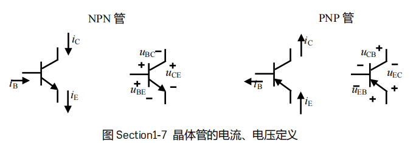
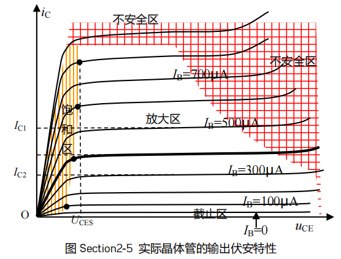
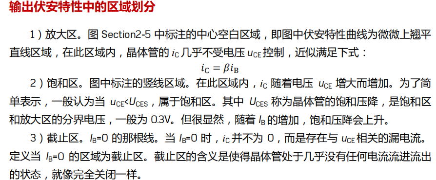

***晶体管***

双极性晶体管和场效应管

# 双极性晶体管

Biopolar Junction Transistor
控制电流，基极和集电极
$$
I_C = \beta I_B
$$
这公式说明双极性晶体管是一个受控电流源，$\beta$称为电流放大倍数，
同时也满足基尔霍夫电流定律，对于NPN型：$I_B + I_C = I_E$
对于PNP型：$I_E = I_B + I_C$,由这些公式可推导出$I_E$和$I_B$的关系

描述一个电学器件的特性，最直观的方法就是了解其伏安特性，晶体管的输入伏安特性，是指基极电流 $I_B$ 与发射结电压 $U_{BE}$ 之间的关系——可能受到$U_{CE}$的影响。
晶体管输出伏安特性，是指一个确定的基极电流 iB 下，集电极电流 iC 与 uCE 之间的关系。

静态和动态
要想实现完美的放大，让晶体管在不加入信号的时候，就处于一个较为合适
的位置，是非常必要的

所谓的静态工作点，是指晶体管放大电路在电源供应正常，且没有施加输入信号的情况下——这叫静态——晶体管各管脚电流以及电压的集合，它是对静态的准确描述，通常在输入、输出伏安特性图中，表现为一个确定的位置，因此称为静态工作点
